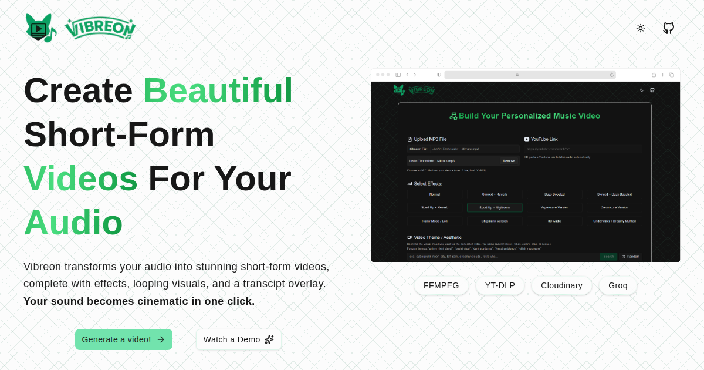

# Vibreon


### Generate personalized short music videos by combining audio (uploaded or extracted from YouTube) with stock background videos, AI-generated lyrics, and audio effects.

---



#### Vibreon is a music video generator that transforms any audio into stunning visual content using FFmpeg. Vibreon makes it effortless to create aesthetic edits, lofi loops, lyric videos, and social-ready content.

### Try the live app here: [https://vibreon.vercel.app](https://vibreon.vercel.app)

--- 

## High-level Overview

Vibreon is a full-stack application that helps users create short, shareable music videos. It combines a frontend built with Next.js and a backend written in Go that performs heavy media processing using FFmpeg and auxiliary tools. The app uses Cloudinary for media storage and delivery, Pexels for background video search, and Groq's Whisper compatible transcription API to generate subtitles (SRT) when requested.

Key responsibilities:
- Frontend (`app/`): UI for uploading/selecting audio, choosing effects and background videos, and initiating generation. Contains serverless API routes that proxy uploads and searches.
- Backend (`backend/`): Long-running media processing (audio effects, video loop + overlay, burning subtitles) and YouTube audio extraction via `yt-dlp`.
- External services: Cloudinary (uploads/hosting), Pexels (video search), Groq (speech → SRT transcription).

## Features

- Upload an MP3 or paste a YouTube URL to extract audio.
- Browse background videos (via Pexels) and select one as the visual.
- Apply audio effects (slowed, bass boost, lofi, 8D, nightcore, etc.).
- Optionally generate AI transcript-based subtitles burned into the final video.
- Final video is processed with FFmpeg and uploaded to Cloudinary, returning a CDN-ready URL.

## How it works

1. User uploads an MP3 or provides a YouTube link via the Next.js UI.
2. If YouTube, Next.js calls the Go backend `/yt/extract` endpoint which runs `yt-dlp` and streams MP3 bytes back; Next.js uploads the MP3 to Cloudinary.
3. User picks a Pexels background video and configures an audio effect and subtitle option.
4. Next.js sends a generation request to the Go backend `/generate` endpoint with the Cloudinary audio URL, video URL, chosen effect, and subtitle flag.
5. Go backend downloads audio/video, applies the chosen audio effect via FFmpeg, optionally calls Groq's Whisper transcription to produce an SRT file, then uses FFmpeg to loop the video, mix audio, and burn subtitles (if present).
6. The final MP4 is uploaded to Cloudinary and the secure URL is returned to the frontend.


## Prerequisites (local development)

- Node.js (16+ recommended) and npm
- Go (1.20+ recommended) for running the backend locally
- FFmpeg installed and available on `PATH` (unless using Docker for backend)
- `yt-dlp` installed (unless using Docker)
- Docker (optional) — a Dockerfile is provided for the backend that includes FFmpeg and `yt-dlp`

## Environment variables

Create a `.env` file at the repository root for frontend serverless routes and a `.env` inside `backend/` for the Go service if running locally. Example values (replace with your secrets):

`.env` (frontend)

```
PEXELS_API_KEY=your_pexels_api_key_here
CLOUDINARY_CLOUD_NAME=your_cloud_name
CLOUDINARY_API_KEY=your_cloudinary_api_key
CLOUDINARY_API_SECRET=your_cloudinary_api_secret
GO_SERVER=http://localhost:8080
```

`backend/.env` (backend)

```
CLOUDINARY_CLOUD_NAME=your_cloud_name
CLOUDINARY_API_KEY=your_cloudinary_api_key
CLOUDINARY_API_SECRET=your_cloudinary_api_secret
GROQ_API_KEY=your_groq_api_key
PORT=8080
```

Notes: `GO_SERVER` should point to the running Go backend from the Next.js runtime (e.g., `http://localhost:8080`).

## Running locally

1) Frontend (Next.js)

```
# from repo root
npm install
npm run dev

# open http://localhost:3000
```

Ensure the frontend sees `CLOUDINARY_*`, `PEXELS_API_KEY` and `GO_SERVER` in its environment. You can set them in a root `.env` (Next.js will load it in dev).

2) Backend (Go)

## Option A — Run locally (needs ffmpeg & yt-dlp on system)

```
cd backend
go run ./cmd/server

# or build then run
go build -o vibreon-backend ./cmd/server
./vibreon-backend
```

## Option B — Run via Docker (image includes ffmpeg & yt-dlp)

PowerShell example:

```powershell
docker build -t vibreon-backend ./backend
docker run -e CLOUDINARY_CLOUD_NAME=... -e CLOUDINARY_API_KEY=... -e CLOUDINARY_API_SECRET=... -e GROQ_API_KEY=... -p 8080:8080 vibreon-backend
```

After the backend is running, make sure `GO_SERVER` in the frontend `.env` points to the correct address (for local dev use `http://localhost:8080`).

## Common troubleshooting

- If `npm run dev` fails: check that your Node version meets the requirement and that `.env` contains the necessary Cloudinary and Pexels keys.
- If backend fails to process audio/video: ensure `ffmpeg` and `yt-dlp` are installed and accessible when not using Docker, and that `GROQ_API_KEY` and Cloudinary creds are set.
- If transcription returns no subtitles: Groq may return empty segments for short or low-quality audio — try toggling `NeedLyrics` off or using clearer audio.

## Contributing

We welcome contributions. A simple workflow:

1. Fork the repository.
2. Create a feature branch: `git checkout -b feat/your-feature`.
3. Make your changes. Keep them focused and follow the established code style.
4. Run the frontend and backend locally and verify behavior.
5. Open a Pull Request with a clear description of the change and testing steps.

Guidelines:
- Keep commits small and atomic.
- Update or add tests where appropriate (this project currently has minimal automated tests).
- Don't commit secrets; include configuration examples using the `.env` pattern above.


---

This is a [Next.js](https://nextjs.org) project bootstrapped with [`create-next-app`](https://nextjs.org/docs/app/api-reference/cli/create-next-app).


## Learn More

To learn more about Next.js, take a look at the following resources:

- [Next.js Documentation](https://nextjs.org/docs) - learn about Next.js features and API.
- [Learn Next.js](https://nextjs.org/learn) - an interactive Next.js tutorial.

You can check out [the Next.js GitHub repository](https://github.com/vercel/next.js) - your feedback and contributions are welcome!

## Deploy on Vercel

The easiest way to deploy your Next.js app is to use the [Vercel Platform](https://vercel.com/new?utm_medium=default-template&filter=next.js&utm_source=create-next-app&utm_campaign=create-next-app-readme) from the creators of Next.js.

Check out our [Next.js deployment documentation](https://nextjs.org/docs/app/building-your-application/deploying) for more details.
